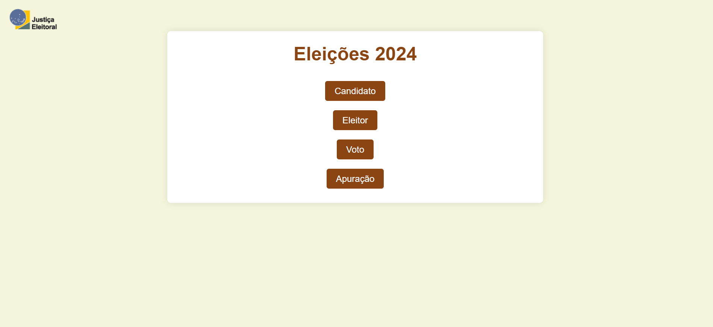

# 🗳️ Réplica de Urna Eletrônica

Sistema completo que simula o ecossistema de uma votação e apuração eleitoral. O projeto conta com interfaces dedicadas para o cadastro de candidatos, gerenciamento de eleitores, simulação de voto e a apuração dos resultados em tempo real.

---

## 🚀 Funcionalidades

* **Cadastro de Candidatos:** Permite registrar os candidatos que disputarão a eleição.
* **Cadastro de Eleitores:** Controle de eleitores aptos a votar no sistema.
* **Módulo de Voto:** Interface simulada para a inserção do voto de forma segura e intuitiva.
* **Apuração dos Votos:** Tela de resultados que contabiliza e exibe a votação de forma clara.

---

## 🛠️ Tecnologias Utilizadas

O projeto foi desenvolvido utilizando a stack clássica para sistemas web dinâmicos:

* **Front-end:** HTML5, CSS3 (Estilização e responsividade) e JavaScript (Interações de tela).
* **Back-end:** PHP (Processamento lógico, sessões e rotas).
* **Banco de Dados:** MySQL (Persistência dos dados de candidatos, eleitores e votos).

---

## 📦 Como Executar o Projeto Localmente

Para rodar este projeto na sua máquina, você precisará de um ambiente que execute PHP e MySQL (como o **XAMPP**, **WampServer** ou **Laragon**).

### Passos:

1. Faça o download do projeto clicando no botão verde **"Code"** e depois em **"Download ZIP"** na página principal deste repositório.
2. Extraia a pasta dentro do diretório do seu servidor local (ex: `C:/xampp/htdocs/` no XAMPP).
3. Abra o `phpMyAdmin` (geralmente em `http://localhost/phpmyadmin`).
4. Crie um novo banco de dados (ex: `urna_eletronica`) e importe o arquivo `.sql` do banco (caso tenha incluído no projeto).
5. Ajuste as credenciais de usuário e senha no seu arquivo de conexão PHP.
6. Abra o seu navegador e acesse: `http://localhost/replica-urna-eletronica/`

---

## 🎨 Demonstração Visual

| Menu Principal |
| :---: |
|  |

---

# 👨‍💻 Autor

Matheus Araujo da Silva

- Site/Portifólio: https://matheus-araujo.net.br
- GitHub: https://github.com/matheusaraujo019
- LinkedIn: https://www.linkedin.com/in/matheus-araujo-da-silva-9a082b388/

---

# 📄 Licença

Este projeto está sob a licença MIT.

